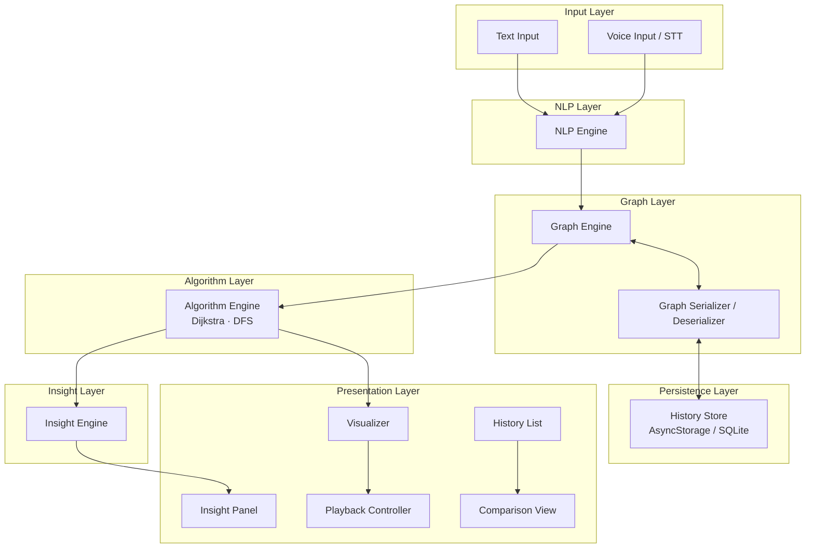

# Design Document: Algorithm Visual Soul

## Overview

Algorithm Visual Soul is an AI-powered mobile application that converts natural-language problem descriptions into interactive, animated graph visualizations. Users describe a problem via text or voice; an NLP engine extracts tasks and relationships; a graph engine constructs a weighted directed graph; and an algorithm engine runs Dijkstra's shortest-path or DFS traversal with step-by-step animation. An insight engine surfaces critical paths, cycle warnings, and isolated-node flags. Sessions are persisted locally for 90 days and can be compared side-by-side.

### Key Design Goals

- Sub-3-second NLP extraction from raw input
- Sub-500ms re-render after any graph mutation
- Offline-first: all persistence is local (no cloud dependency)
- Round-trip integrity: any graph that can be serialized can be deserialized to an identical graph
- Accessible touch targets (44×44 pt minimum) and WCAG-adjacent dark theme (<15% luminance)

---

## Architecture

The application follows a layered, unidirectional-data-flow architecture suited to a mobile client (React Native / Expo is assumed as the target stack, but the design is framework-agnostic at the component boundary level).



### Data Flow Summary

1. User submits text or voice → **NLP Engine** extracts `{nodes[], edges[]}` within 3 s.
2. **Graph Engine** builds an in-memory `Graph` object and emits it to the **Visualizer**.
3. User selects an algorithm → **Algorithm Engine** produces an ordered `Step[]` list.
4. **Visualizer** + **Playback Controller** animate steps at 500 ms/step.
5. On completion, **Insight Engine** analyses the result and populates the **Insight Panel**.
6. User saves → **Graph Serializer** converts to JSON → **History Store** persists.
7. User loads history → **History Store** → **Graph Serializer** deserializes → **Graph Engine** restores state.

---

## Components and Interfaces

### NLP Engine

Responsible for converting raw text into a structured graph description.

```ts
interface NLPResult {
  nodes: Array<{ id: string; label: string }>;
  edges: Array<{ sourceId: string; targetId: string; weight?: number; label?: string }>;
}

interface NLPEngine {
  extract(input: string): Promise<NLPResult>;
  // Rejects with NLPExtractionError if no meaningful tasks found
}
```

- Timeout budget: 3 000 ms (requirement 1.3)
- On failure: throws `NLPExtractionError` with a human-readable message (requirement 1.4)
- Implementation: on-device model (e.g., a fine-tuned sentence-transformer) or a thin API call to a hosted LLM with a local fallback

### Graph Engine

Owns the canonical in-memory graph and exposes mutation operations.

```ts
interface Node {
  id: string;
  label: string;
  position?: { x: number; y: number };
}

interface Edge {
  id: string;
  sourceId: string;
  targetId: string;
  weight: number;   // default 1 (requirement 2.2)
  label?: string;
}

interface Graph {
  nodes: Map<string, Node>;
  edges: Map<string, Edge>;
}

interface GraphEngine {
  buildFromNLP(result: NLPResult): Graph;
  addNode(graph: Graph, node: Omit<Node, 'id'>): Graph;
  removeNode(graph: Graph, nodeId: string): Graph;       // also removes incident edges (req 4.3)
  addEdge(graph: Graph, edge: Omit<Edge, 'id'>): Graph;
  removeEdge(graph: Graph, edgeId: string): Graph;
  editNode(graph: Graph, nodeId: string, patch: Partial<Pick<Node, 'label'>>): Graph;
  editEdge(graph: Graph, edgeId: string, patch: Partial<Pick<Edge, 'weight' | 'label'>>): Graph;
}
```

Constraints:
- Max 100 nodes, 500 edges (requirement 2.5)
- Throws `GraphSizeError` when limits are exceeded

### Graph Serializer

Pure functions — no side effects, no I/O.

```ts
interface GraphSerializer {
  serialize(graph: Graph): string;           // returns JSON string
  deserialize(json: string): Graph;          // throws DeserializationError on invalid input
}
```

Round-trip guarantee: `deserialize(serialize(g))` produces a graph structurally equal to `g` (requirement 8.4).

### Algorithm Engine

```ts
type AlgorithmType = 'dijkstra' | 'dfs';

interface AlgorithmStep {
  stepIndex: number;
  activeNodeId: string;
  visitedNodeIds: string[];
  traversedEdgeIds: string[];
  distanceMap?: Map<string, number>;   // Dijkstra only
}

interface AlgorithmResult {
  algorithm: AlgorithmType;
  steps: AlgorithmStep[];
  shortestPaths?: Map<string, string[]>;  // Dijkstra: nodeId → path of nodeIds
  visitOrder?: string[];                  // DFS: ordered node visit sequence
}

interface AlgorithmEngine {
  run(graph: Graph, algorithm: AlgorithmType, sourceNodeId: string): AlgorithmResult;
}
```

### Playback Controller

Manages animation state as a finite state machine:

```
IDLE → PLAYING → PAUSED → PLAYING
                         → COMPLETED
     → STEP_FORWARD (manual)
     → STEP_BACKWARD (manual)
     → RESTART → IDLE
```

```ts
interface PlaybackController {
  play(): void;
  pause(): void;
  stepForward(): void;
  stepBackward(): void;
  restart(): void;
  setSpeed(msPerStep: number): void;  // default 500ms (req 3.7)
  readonly currentStep: number;
  readonly totalSteps: number;
  readonly state: 'idle' | 'playing' | 'paused' | 'completed';
}
```

### Insight Engine

```ts
interface Insight {
  type: 'critical_path' | 'cycle_detected' | 'isolated_node' | 'general';
  message: string;
  affectedNodeIds?: string[];
  affectedEdgeIds?: string[];
}

interface InsightEngine {
  analyse(graph: Graph, result: AlgorithmResult): Insight[];
}
```

- Always produces ≥ 1 insight after algorithm completion (requirement 5.1)
- Dijkstra: emits `critical_path` insight (requirement 5.2)
- DFS: emits `cycle_detected` insight if cycles found (requirement 5.3)
- Always checks for isolated nodes and emits `isolated_node` insights (requirement 5.5)

### History Store

```ts
interface SessionRecord {
  id: string;
  createdAt: number;       // Unix ms timestamp
  graphJson: string;       // serialized Graph
  algorithm: AlgorithmType;
  algorithmResult: AlgorithmResult;
  insights: Insight[];
  label?: string;
}

interface HistoryStore {
  save(session: Omit<SessionRecord, 'id' | 'createdAt'>): Promise<SessionRecord>;
  list(): Promise<SessionRecord[]>;          // ordered most-recent-first (req 7.2)
  load(id: string): Promise<SessionRecord>;
  delete(id: string): Promise<void>;
  // Automatically purges sessions older than 90 days on load (req 7.5)
}
```

### Visualizer

The Visualizer is a React Native canvas component (using `react-native-svg` or `react-native-skia`) that:

- Renders nodes as circles with labels
- Renders edges as directed arrows with weight labels
- Applies neon glow to active/traversed elements (requirement 6.2)
- Supports portrait and landscape layout (requirement 6.4)
- Enforces 44×44 pt minimum tap targets (requirement 6.5)
- Re-renders within 500 ms after any graph mutation (requirement 4.6)

---

## Data Models

### Graph (in-memory)

```ts
// Immutable value objects — mutations return new Graph instances
type NodeId = string;   // UUID v4
type EdgeId = string;   // UUID v4

interface Node {
  id: NodeId;
  label: string;
  position: { x: number; y: number };
}

interface Edge {
  id: EdgeId;
  sourceId: NodeId;
  targetId: NodeId;
  weight: number;       // positive number, default 1
  label: string;        // defaults to weight.toString()
}

interface Graph {
  nodes: Map<NodeId, Node>;
  edges: Map<EdgeId, Edge>;
}
```

### Serialized Graph (JSON)

```json
{
  "nodes": [
    { "id": "uuid", "label": "Task A", "position": { "x": 100, "y": 200 } }
  ],
  "edges": [
    { "id": "uuid", "sourceId": "uuid", "targetId": "uuid", "weight": 1, "label": "1" }
  ]
}
```

### AlgorithmStep

```ts
interface AlgorithmStep {
  stepIndex: number;          // 0-based
  activeNodeId: NodeId;
  visitedNodeIds: NodeId[];
  traversedEdgeIds: EdgeId[];
  distanceMap?: Record<NodeId, number>;  // Dijkstra only; Infinity for unreachable
}
```

### SessionRecord (persisted)

```ts
interface SessionRecord {
  id: string;                  // UUID v4
  createdAt: number;           // Unix ms
  label: string;               // user-editable display name
  graphJson: string;           // JSON.stringify(SerializedGraph)
  algorithm: 'dijkstra' | 'dfs';
  sourceNodeId: string;
  algorithmResult: {
    steps: AlgorithmStep[];
    shortestPaths?: Record<NodeId, NodeId[]>;
    visitOrder?: NodeId[];
  };
  insights: Insight[];
}
```

### NLPResult (internal transfer object)

```ts
interface NLPResult {
  nodes: Array<{ id: string; label: string }>;
  edges: Array<{
    sourceId: string;
    targetId: string;
    weight?: number;
    label?: string;
  }>;
}
```

---


## Correctness Properties

*A property is a characteristic or behavior that should hold true across all valid executions of a system — essentially, a formal statement about what the system should do. Properties serve as the bridge between human-readable specifications and machine-verifiable correctness guarantees.*

---

### Property 1: Input length boundary

*For any* string of length ≤ 2000 characters, the text input component shall accept it without error; for any string of length > 2000 characters, the component shall reject or truncate it.

**Validates: Requirements 1.1**

---

### Property 2: NLP extraction completes within timeout

*For any* valid non-empty text input, the NLP engine shall resolve (or reject) within 3 000 ms.

**Validates: Requirements 1.3**

---

### Property 3: NLP result maps to graph structure

*For any* NLPResult produced by the NLP engine, every node entry in the result shall appear as a Node in the constructed Graph, and every edge entry shall appear as an Edge — no nodes or edges are silently dropped.

**Validates: Requirements 2.1**

---

### Property 4: Default edge weight is 1

*For any* edge in an NLPResult that carries no explicit weight, the corresponding Edge in the constructed Graph shall have weight equal to 1.

**Validates: Requirements 2.2**

---

### Property 5: Algorithm engine produces non-empty ordered steps

*For any* connected Graph with at least 2 nodes and a valid source node, running either Dijkstra or DFS shall produce an AlgorithmResult whose `steps` array is non-empty and whose `stepIndex` values form a contiguous sequence starting at 0.

**Validates: Requirements 3.2**

---

### Property 6: Dijkstra shortest-path correctness

*For any* weighted directed Graph and any pair of reachable nodes (source, target), the path returned by Dijkstra shall have a total weight less than or equal to the total weight of every other path from source to target in the graph.

**Validates: Requirements 3.5**

---

### Property 7: Playback controller state machine invariants

*For any* sequence of playback control actions (play, pause, stepForward, stepBackward, restart), the controller's `currentStep` shall always remain within `[0, totalSteps - 1]`, and the `state` field shall only ever hold one of the four defined values (`idle`, `playing`, `paused`, `completed`).

**Validates: Requirements 3.6**

---

### Property 8: Node removal cascades to incident edges

*For any* Graph and any node ID present in that graph, removing the node shall produce a Graph in which neither the node nor any edge whose `sourceId` or `targetId` matched that node ID is present.

**Validates: Requirements 4.3**

---

### Property 9: Edit node/edge reflects new values

*For any* Graph, node ID, and new label value, calling `editNode` shall produce a Graph where the node with that ID has the updated label and all other nodes and edges are unchanged. The same holds for `editEdge` with weight and label.

**Validates: Requirements 4.5**

---

### Property 10: Algorithm re-run uses updated graph

*For any* Graph G1, mutation M that produces G2, and algorithm A, running A on G2 shall produce a result consistent with G2's structure — not G1's. Specifically, any node or edge present only in G2 may appear in the result, and any node or edge removed in G2 shall not appear.

**Validates: Requirements 4.7**

---

### Property 11: Insight engine always produces at least one insight

*For any* Graph and any AlgorithmResult, `InsightEngine.analyse` shall return an array of length ≥ 1.

**Validates: Requirements 5.1**

---

### Property 12: Dijkstra run always produces a critical-path insight

*For any* Graph and any Dijkstra AlgorithmResult, the insights array shall contain at least one entry with `type === 'critical_path'`.

**Validates: Requirements 5.2**

---

### Property 13: DFS detects cycles correctly

*For any* Graph that contains at least one directed cycle, running DFS and analysing the result shall produce at least one insight with `type === 'cycle_detected'`. Conversely, for any acyclic graph, no `cycle_detected` insight shall be emitted.

**Validates: Requirements 5.3**

---

### Property 14: Isolated nodes are flagged

*For any* Graph containing at least one node with no incident edges (degree 0), the insights array shall contain at least one `isolated_node` insight whose `affectedNodeIds` includes that node's ID.

**Validates: Requirements 5.5**

---

### Property 15: Session save/load round-trip

*For any* session (graph, algorithm, algorithmResult, insights), saving then loading that session shall produce a SessionRecord whose deserialized graph is structurally identical to the original (same nodes, edges, weights, labels), and whose algorithm, algorithmResult, and insights fields are deeply equal to the originals.

**Validates: Requirements 7.1, 7.3**

---

### Property 16: History list is ordered most-recent-first

*For any* collection of saved sessions with distinct `createdAt` timestamps, `HistoryStore.list()` shall return them in descending order of `createdAt`.

**Validates: Requirements 7.2**

---

### Property 17: Deleted session is absent from history

*For any* session ID that has been saved and then deleted, subsequent calls to `HistoryStore.list()` shall not contain a record with that ID.

**Validates: Requirements 7.4**

---

### Property 18: Sessions within 90 days are retained; older sessions are purged

*For any* session with `createdAt` within the last 90 days (7 776 000 000 ms), it shall appear in the history list. *For any* session with `createdAt` more than 90 days in the past, it shall not appear in the history list after a list operation.

**Validates: Requirements 7.5**

---

### Property 19: NLP output conforms to NLPResult schema

*For any* text input that the NLP engine successfully processes, the returned value shall be an object with a `nodes` array and an `edges` array, where every node entry has an `id` and `label`, and every edge entry has a `sourceId` and `targetId`.

**Validates: Requirements 8.1**

---

### Property 20: Graph serialization round-trip

*For any* valid Graph object G, `deserialize(serialize(G))` shall produce a Graph with identical node IDs, node labels, node positions, edge IDs, edge sourceIds, edge targetIds, edge weights, and edge labels.

**Validates: Requirements 8.2, 8.3, 8.4**

---

### Property 21: Malformed JSON deserialization returns error without state mutation

*For any* string that is not valid JSON or does not conform to the serialized Graph schema, calling `deserialize` shall throw a `DeserializationError` and shall not modify any existing application state.

**Validates: Requirements 8.5**

---

## Error Handling

| Error | Source | Behaviour |
|---|---|---|
| `NLPExtractionError` | NLP Engine | Thrown when no tasks can be extracted. UI shows descriptive message prompting user to rephrase. |
| `NLPTimeoutError` | NLP Engine | Thrown when extraction exceeds 3 000 ms. UI shows timeout message with retry option. |
| `GraphSizeError` | Graph Engine | Thrown when node count > 100 or edge count > 500. UI shows limit-exceeded message. |
| `InsufficientGraphError` | Graph Engine | Thrown when NLPResult yields < 2 nodes. UI prompts user for more detail. |
| `DeserializationError` | Graph Serializer | Thrown on malformed/invalid JSON. Application state is not modified. |
| `AlgorithmError` | Algorithm Engine | Thrown for disconnected source node or invalid graph state. UI shows error with suggestion to check graph connectivity. |

### Error Handling Principles

- All errors are typed (not plain `Error`) so callers can discriminate without string matching.
- Errors never mutate application state — they are thrown before any write occurs.
- Every error carries a `message` field suitable for direct display to the user.
- The UI layer catches errors at component boundaries and renders inline error states rather than crashing.

---

## Testing Strategy

### Dual Testing Approach

Both unit tests and property-based tests are required. They are complementary:

- **Unit tests** verify specific examples, integration points, and error conditions.
- **Property-based tests** verify universal properties across randomly generated inputs, catching edge cases that hand-written examples miss.

### Property-Based Testing Library

**Target language**: TypeScript / JavaScript (React Native)
**PBT library**: [`fast-check`](https://github.com/dubzzz/fast-check)

Each property-based test must:
- Run a minimum of **100 iterations** (configured via `fc.assert(..., { numRuns: 100 })`).
- Include a comment tag in the format:
  `// Feature: algorithm-visual-soul, Property <N>: <property_text>`

Each correctness property listed above maps to exactly **one** property-based test.

### Property Test Mapping

| Property | Test description | fast-check arbitraries |
|---|---|---|
| P1 | Input length boundary | `fc.string({ maxLength: 3000 })` |
| P2 | NLP timeout | `fc.string({ minLength: 1 })` with timer mock |
| P3 | NLP result → graph structure | `fc.record({ nodes: fc.array(...), edges: fc.array(...) })` |
| P4 | Default edge weight | NLPResult edges with no weight field |
| P5 | Algorithm produces ordered steps | Random connected graph + source node |
| P6 | Dijkstra shortest-path correctness | Random weighted DAG |
| P7 | Playback state machine invariants | `fc.array(fc.constantFrom('play','pause','stepForward','stepBackward','restart'))` |
| P8 | Node removal cascades | Random graph + random node ID |
| P9 | Edit node/edge reflects new values | Random graph + random node/edge + random label/weight |
| P10 | Re-run uses updated graph | Random graph + random mutation + algorithm |
| P11 | Insight engine ≥ 1 insight | Random graph + random AlgorithmResult |
| P12 | Dijkstra → critical_path insight | Random graph + Dijkstra result |
| P13 | DFS cycle detection | Random cyclic and acyclic graphs |
| P14 | Isolated nodes flagged | Random graph with injected isolated nodes |
| P15 | Session save/load round-trip | Random SessionRecord |
| P16 | History ordered most-recent-first | `fc.array(fc.record({ createdAt: fc.integer() }))` |
| P17 | Deleted session absent | Random session ID |
| P18 | 90-day retention policy | Sessions with random `createdAt` relative to now |
| P19 | NLP output schema conformance | Random valid text inputs |
| P20 | Graph serialization round-trip | Random Graph objects |
| P21 | Malformed JSON → error, no state mutation | `fc.string()` filtered to non-valid graph JSON |

### Unit Test Focus Areas

- NLP engine: specific example inputs with known expected node/edge extractions
- Graph engine: boundary conditions (exactly 100 nodes, exactly 500 edges, 0 nodes, 1 node)
- Algorithm engine: known small graphs with hand-verified Dijkstra/DFS outputs
- Insight engine: graphs with known cycles, known isolated nodes, known critical paths
- History store: session ordering with fixed timestamps, 90-day boundary (89 days vs 91 days)
- Serializer: known valid JSON → graph, known invalid JSON → error

### Integration Test Focus Areas

- Full pipeline: text input → NLP → graph → algorithm → insights
- Session save → app restart simulation → session load → graph restore
- Graph mutation → algorithm re-run → updated insights

### Test File Structure

```
src/
  nlp/
    nlpEngine.test.ts          # unit
    nlpEngine.property.test.ts # PBT
  graph/
    graphEngine.test.ts
    graphEngine.property.test.ts
    graphSerializer.test.ts
    graphSerializer.property.test.ts
  algorithm/
    algorithmEngine.test.ts
    algorithmEngine.property.test.ts
  insight/
    insightEngine.test.ts
    insightEngine.property.test.ts
  history/
    historyStore.test.ts
    historyStore.property.test.ts
  playback/
    playbackController.test.ts
    playbackController.property.test.ts
  integration/
    pipeline.test.ts
```
